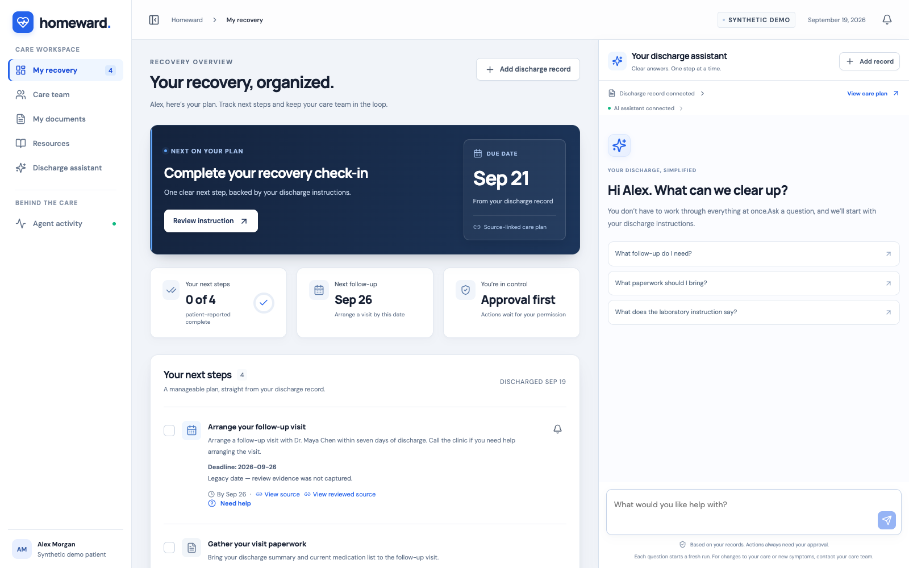
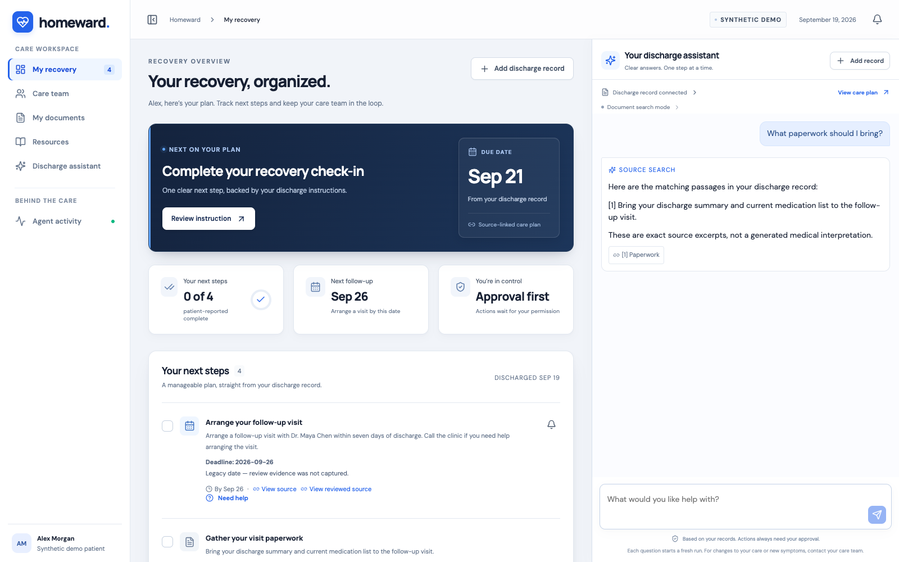
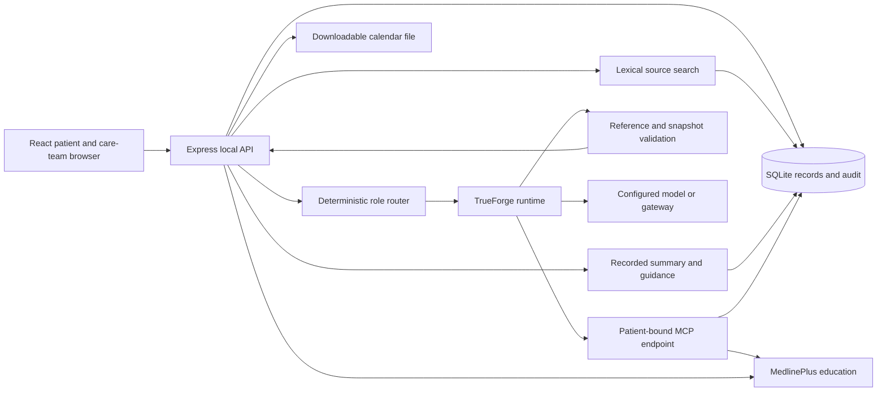
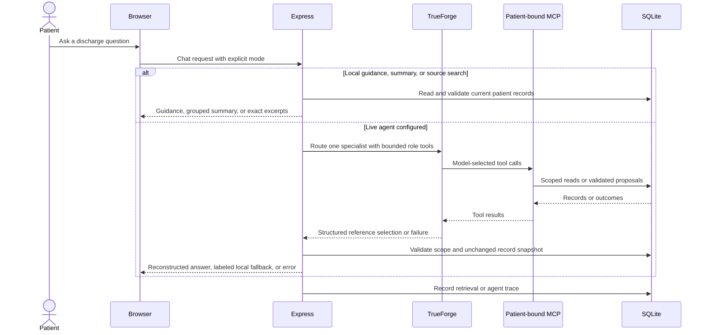
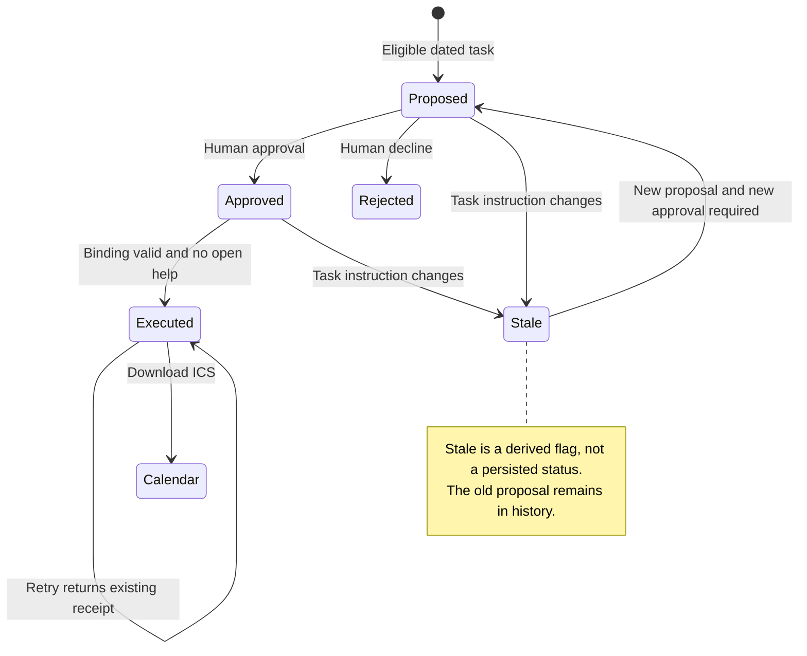
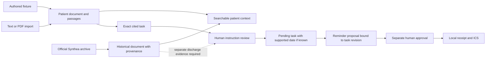

# Homeward

**A clearer next step after discharge.**

Homeward helps a patient understand their discharge instructions, see what to do next, trace each task back to its source, and ask for help when something is unclear. A persistent assistant sits beside the recovery plan; a local care-team workspace makes unresolved instructions and patient questions visible.

The intended result is a patient who knows **what to do, where the instruction came from, and what still needs clarification**. Improved adherence and reduced readmissions are aspirations, not measured outcomes. This is a synthetic-data prototype for the Agent Harness Hackathon, organized by TrueFoundry and HackerSquad with sponsorship from OpenAI.



*Recorded Chrome capture of application commit `0ce9dad`, September 19, 2026. The desktop workspace allocates 60% to the dashboard and 40% to the assistant. The captured “AI assistant connected” label indicates configured models, not a verified successful model call.*

**Evidence at a glance:** the current assessed commit, `eaf86d9`, passes 59 Node tests, 4 DOM journeys, 32 deterministic evaluation cases, and the production build. Earlier real-browser captures establish a source-search journey on `0ce9dad`. The recorded live-agent trial failed authentication before returning an answer; live-agent reliability remains unverified. [Current verification](docs/evidence/readme-audit/README.md) · [Recorded browser/live evidence](docs/evidence/integrated-main/README.md)

[Patient journey](docs/PATIENT_JOURNEY.md) · [Technical assessment](docs/SUBSYSTEM_ASSESSMENT.md) · [Demo script](docs/DEMO.md) · [Presentation](docs/PRESENTATION.md) · [Review API](docs/DISCHARGE-REVIEW-API.md)

## What a patient experiences

Alex opens a recovery plan containing follow-up, paperwork, and check-in tasks. A laboratory instruction is incomplete: neither the test nor its date is specified. Homeward keeps that uncertainty visible instead of filling it in.

| Patient action | System response | Intended benefit |
| --- | --- | --- |
| Open the next task | Show its instruction, deadline when known, and source | Understand the immediate next step |
| Ask what paperwork to bring | Retrieve the passage locally, or have a live specialist select references that the server validates | Find relevant instructions without rereading everything |
| Ask “What is my next step?” | Use the same deterministic guidance as the dashboard, including blockers and missing dates | Get consistent plan navigation without a model |
| Open **My discharge summary** | Group ready, attention, completed, rejected, unreviewed, and historical items | Review the record without treating history as new orders |
| Choose **View source** | Display the exact original passage | Check the basis for a task or answer |
| Choose **Need help** | Persist a help request and pause completion/reminder actions | Make uncertainty visible before acting |
| Read a care-team demo response | Display the locally saved response and history | See what was addressed and what remains unresolved |
| Approve an eligible reminder | Create a local calendar file after separate execution | Make a known follow-up date easier to remember |
| Import an additional record | Make passages searchable; proposed tasks await human review | Incorporate new information without silently activating it |



*This answer is deterministic source search: exact excerpts, no model generation. The full [illustrated journey](docs/PATIENT_JOURNEY.md) includes help resolution, review, approval, safe retry, provenance, and activity evidence.*

The care-team user is a **local demo operator**, not an authenticated clinician. Responding to a question, reviewing an instruction, and approving a reminder are separate actions. Resolving a help request does not verify its instruction. No external clinician notification is sent.

## Features and boundaries

| Capability | Implemented behavior | Boundary |
| --- | --- | --- |
| Recovery workspace | Source-linked tasks, known dates, patient-reported completion, collapsible navigation, persistent assistant | Completion is self-reported; the demo date is September 19, 2026 |
| Record import | Text-based PDF, TXT/Markdown, pasted text; immutable source passages | No scanned-image OCR or automatic end-to-end discharge-plan extraction |
| Retrieval | Patient-scoped lexical matching, up to four passages | No embedding index, vector database, semantic ranking, or clinical conflict adjudication |
| Instruction review | Confirm, clarify, reject; exact source and date evidence; revision checks and audit history | Human demo review does not establish clinical validation |
| Help handling | Request, withdraw, respond, resolve; patient-visible response/history | Withdrawal is distinct from operator resolution; neither clears instruction-review requirements |
| Reminders | Proposal, human approval/rejection, execution, retry deduplication, `.ics` download | No appointment booking, email/SMS delivery, background notification scheduler, or automatic calendar insertion |
| Education | MedlinePlus topic lookup with attributed curated fallback | General education never becomes a personalized order |
| Agent team | Four task-routed TrueForge specialists, server-enforced tool subsets, structured reference selection | One role per live request; no parallel agent swarm or dynamic subagents |
| Recorded summary and guidance | Shared next-step logic and grouped source-linked cards; old summary notices after record changes | Scheduling order is not medical urgency; summaries do not approve tasks |
| Emergency call control | Persistent user-initiated `tel:911` link for the US demo | No automated triage, emergency dispatch, or guaranteed call connection |

## How the system works



The same backend rules govern UI and MCP mutations. Express owns import, review, help, reminder, and chat endpoints. SQLite stores documents, tasks, actions, audit entries, retry receipts, and traces. TrueForge owns live model/tool execution; Homeward binds its tools to one patient. [Source inventory and architecture detail](docs/SUBSYSTEM_ASSESSMENT.md)

### Saved records and model-assisted selection

Recognized next-step questions use deterministic plan guidance in either requested mode. The dashboard and chat share the same eligibility, source, and recorded-date checks. **My discharge summary** also works locally: it groups current tasks, gaps, and source passages without creating instructions. The summary includes a snapshot version so older chat summaries can be identified after records change.

Other **Source search** questions return exact lexical matches with structured citations. In **TrueForge agent** mode, a deterministic router selects one specialist. The model returns a JSON reference envelope rather than replacement clinical prose; the backend validates references and reconstructs answers from exact passages, current task states, and actual reminder receipts. The UI retains chat messages per patient in browser storage, but each live question starts a fresh session without sending prior conversation turns.



This describes the current implemented control flow, not a successful recorded live run. Malformed/out-of-scope model output or a changed clinical snapshot produces a labeled saved-record fallback. The summarizer also falls back when its model is unavailable or execution fails; other runtime failures surface as errors. Grounding checks do not prove that selected evidence is clinically appropriate or fully answers the question. [Agent-team contract](docs/AGENT-TEAM.md)

| Specialist | Role ID | Allowed tool purposes |
| --- | --- | --- |
| Care-plan coordinator | `coordinator` | Plan, summary, search, cited-task proposal, education |
| Discharge summarizer | `summarizer` | Summary and source search only |
| Questions and sources | `questions` | Plan, source search, education |
| Reminder assistant | `reminders` | Plan, reminder proposal, execution of a separately approved reminder |

The router uses explicit intent when provided, otherwise recognized summary requests and keyword rules. All roles use the configured model; this is task routing, not automatic model/provider selection. Tool subsets are enforced both in the AgentSpec and by `/mcp/:patientId/:role`. Native TrueForge tool-approval pauses are not enabled because the app does not yet resume paused turns; Homeward's existing approval checks remain authoritative.

### What the agent may do

| MCP tool | Permission |
| --- | --- |
| `get_discharge_plan` | Read the bound patient's plan, documents, and derived guidance |
| `get_discharge_summary` | Read the current grouped summary and snapshot version |
| `search_discharge_instructions` | Retrieve matching source passages |
| `propose_cited_task` | Add an exact cited passage for human review |
| `propose_reminder` | Propose a reminder for an eligible dated task |
| `execute_approved_reminder` | Execute an already approved, still-valid local reminder |
| `lookup_patient_education` | Retrieve general topic links |

There are no MCP tools for instruction review, help responses, or human approval. Those are separate UI/API operations. Patient binding is a **tool boundary**; the no-login local app is not production identity isolation.

The live configuration limits a turn to 8 iterations and 1,800 requested output tokens. Homeward allows one active live request per patient and eight live requests per minute across its process. It polls toward a 90-second run budget and attempts cancellation on expiry; this is not a hard billing or wall-clock guarantee. Provider/model routing, provider failover, automatic model retries, and dollar-denominated spending caps are not implemented. A local fallback is labeled as saved records, not successful live execution.

### Human review and reliable action

A new cited task starts in `needs_clarification`, with no deadline. Human review can confirm it, keep it awaiting clarification, or reject it while retaining history. Dates need an explicit source passage or a separately attributed human explanation; relative dates are not automatically converted during review. Historical Synthea passages cannot authorize discharge instructions. Existing seeded dates are labeled as legacy evidence rather than retroactively attributed to a reviewer.

Reviews and help responses use a revision plus a retry UUID. A stale form must reload; an identical retry reuses its result. Reminder proposals bind to the task instruction revision and fingerprint. Changed instructions invalidate old unexecuted proposals. [Full review contract](docs/DISCHARGE-REVIEW-API.md)



An open help request pauses applicable actions. Resolving or withdrawing it resumes eligibility only if other checks still pass. Already-created calendar files are not recalled. The timeout demo saves first, then simulates a lost response; retrying returns the same receipt.

## Data sources and lifecycle

| Source | What it supplies | Provenance and treatment |
| --- | --- | --- |
| [Authored fixtures](server/fixtures.js) | Alex, Jordan, Sam and fictional discharge instructions | Exact passage references; seeded deadlines are not extracted by an LLM |
| [Bundled Synthea sample](data/synthea-sample.json) | Hui's historical synthetic encounter and context | Official archive URL/hash, CSV file/hash/row, source fields, snapshot date; separate from discharge orders |
| User-imported synthetic records | Additional searchable instructions | Original text passages and import timestamp; proposed tasks require review |
| [MedlinePlus Web Service](https://medlineplus.gov/about/developers/webservices/) | General educational links | Fixed generic topic queries; no patient identifiers in the education query; live results cached 12 hours, fallback results 60 seconds |



Homeward stores local state in `.local/homeward.sqlite`; browser chat history and menu preference live in localStorage. TrueForge stores its own sessions separately. Model/tool use may send synthetic questions and retrieved content to the configured provider; the MedlinePlus privacy boundary does not apply to all model traffic.

The Synthea importer selects the latest completed inpatient encounter in the downloaded sample and filters historical rows as of its discharge day. Regenerate with Python 3 and network access:

```sh
python scripts/ingest-synthea.py
```

The upstream `latest` archive can change. Review the JSON/provenance diff; this command is a refresh, not guaranteed byte-for-byte reproduction. The committed snapshot works offline. Startup preserves existing patients; an explicit demo reset is needed to reload changed data for an existing patient. Reset removes local backend demo records, actions, audits, and traces; it does not clear browser chat history or external TrueForge sessions.

## Run locally

Requires Git and Node.js 22.14+; Node 24 is used by CI. From the repository root:

```sh
npm ci
npm run build
npm start
```

Open **http://localhost:8000**. Leave the server terminal running. No model credentials are needed for the local workflow or source search. For development, stop that server and run `npm run dev`, then open **http://localhost:5173**; it proxies to the backend on port 8000. On Windows, use `npm.cmd` if PowerShell blocks `npm.ps1`.

The app binds to loopback and has no login. Use synthetic data and keep this prototype local. Each teammate's `localhost` is their own machine. Separate clones have separate `.local` databases.

### Connect TrueForge and MCP

1. Start TrueForge in a second terminal with `npx @truefoundry/trueforge@0.2.0` to match the runtime version in the recorded trial. That trial did not validate successful provider execution; recheck integration after any version change. [Official launch documentation](https://trueforge.dev/quickstart)
2. Open **http://localhost:8790 → Settings → Models**. Configure your authorized provider credentials, or a custom compatible gateway with its exact base URL and model IDs. Keep keys in TrueForge, not Git or chat. [Model configuration](https://trueforge.dev/models)
3. In a third terminal at the Homeward root, run `npm run setup:trueforge`. It registers legacy patient connectors and, if a model is ready, four role connectors and saved example agents per patient. Existing saved definitions are preserved. The Homeward chat path creates fresh inline role specifications.
4. Run `npm run smoke:trueforge` only with an authorized model-call budget. Inspect both the answer and the actual session/tool calls. Use `npm run smoke:trueforge -- --summary` for the summarizer; each invocation may consume credits. The script requires a model-assisted response, session ID, and citations, rejecting local fallback as proof of live execution. A listed model or green UI indicator does not prove working credentials.
5. Select **TrueForge agent** in the assistant's settings and ask a sourced paperwork question. Use **Source search** explicitly when demonstrating the verified no-model path.

For manual setup under TrueForge **Settings → Connectors**, Alex's URL is `http://localhost:8000/mcp/demo-001`, name `homeward-demo-001`, transport Streamable HTTP, authentication **No auth** for this local demo. `/mcp` is also bound to Alex; other patients use `/mcp/:patientId`. These legacy endpoints expose seven tools; specialist endpoints append `/coordinator`, `/summarizer`, `/questions`, or `/reminders` and expose only that role's subset. The setup script is preferred. [Connector documentation](https://trueforge.dev/mcp-servers)

| Homeward variable | Default | Purpose |
| --- | --- | --- |
| `PORT` | `8000` | Local API/UI port |
| `TRUEFORGE_URL` | `http://localhost:8790` | Runtime API address |
| `TRUEFORGE_MODEL` | First configured model | Optional exact TrueForge model name |
| `TRUEFORGE_TOKEN` | Unset | Optional runtime authorization, not the model-provider API key |
| `MCP_PUBLIC_URL` | `http://localhost:8000/mcp` | Connector base URL reachable from TrueForge |

Use [.env.example](.env.example) for local overrides, without overwriting an existing `.env`. Restart Homeward after changing it. Changing the port also requires a matching connector base URL; a hosted runtime cannot reach your laptop through its own `localhost`.

## Reproduce the demo and evidence

For the short presentation: open Alex, show an exact source, ask the paperwork question in **Source search**, request help for the laboratory item, show that local resolution preserves its review gate, then approve a reminder and demonstrate timeout/retry. Finish with actual activity and evaluation results. [Executable walkthrough](docs/PATIENT_JOURNEY.md) · [Three-minute script](docs/DEMO.md)

Use a separate clone for a rehearsal that may alter synthetic state. Do not reset the team's active demo. The existing browser runner uses an isolated in-memory Store and guards against live chat; its pinned snapshot and tooling prerequisites are documented in [the capture guide](docs/PATIENT_JOURNEY.md#capture-provenance-and-reproduction).

| Command | What it does | Paid model calls? |
| --- | --- | --- |
| `npm run check` | Node/HTTP/MCP/DOM tests and production build | No |
| `npm run eval` | Deterministic checks; writes `.local/evaluation.json` for Agent activity | No |
| `npm run eval:live` | Configuration preflight and injected runtime outage | No model turns |
| `npm run smoke:trueforge` | One actual app/model request | Yes, when configured |
| `npm run eval:live -- --run --max-requests 1 --scenario paperwork --budget-reference TEAM-APPROVAL-ID` | One explicitly authorized scenario in an isolated instance | Yes |

Replace the budget reference with an actual team authorization. The live runner caps requests per invocation (1–10), not dollars or cumulative usage across invocations. A single request may involve multiple model calls. Preflight can exit with code 2 because live scenarios were not run; that does not mean they passed. See [live evaluation instructions](docs/LIVE-EVALUATIONS.md).

## What the evidence establishes

| Scope | Actual evidence | What it does not establish |
| --- | --- | --- |
| Current assessed code `eaf86d9`, September 19, 2026 | 59 Node tests + 4 DOM journeys; build passed; 32/32 deterministic cases | Clinical correctness or provider reliability; dependency installation was reused |
| Recorded app `0ce9dad`, same date | 40 Node + 2 DOM tests; 21/21 cases; Chrome journey with 10 captures and 7 assertion groups | Browser validation of every later change or every screen size |
| Recorded narrow viewport | No horizontal page overflow at 390×844; menu dismissal checked | Complete mobile or accessibility certification |
| Recorded live evaluation | One attempted request rejected with invalidated-key HTTP 401; Homeward surfaced 502; no answer or MCP calls | Successful live integration, answer quality, or repeated-run reliability |
| Injected runtime outage | Error surfaced without a fabricated answer | Model behavior under real provider failure |
| Planned outcomes | Better comprehension and follow-through are product goals | Measured adherence improvement or fewer readmissions |

The screenshot manifest identifies the earlier source-search run. It predates the specialist team, summary view, guidance refinements, and emergency link; those additions have current code/automated-test evidence, not fresh browser captures. Current local readiness is machine-specific; during this documentation audit this machine had no configured model. That does not erase the separate recorded failed trial. Bundled/cached chat or the optional `?history=1` transcript is not fresh execution evidence. No successful live-agent screenshot is claimed here.

[Current audit outputs](docs/evidence/readme-audit/README.md) · [Recorded live failure](docs/evidence/integrated-main/README.md) · [Validation methodology](docs/VALIDATION.md)

## Limitations and next work

First, repair provider access and complete authorized, human-reviewed live scenarios and repeats. Also distinguish “model configured” from verified execution in the status UI, and make replayed transcripts unmistakable. Other priorities are retrieval/conflict evaluation, broader accessibility testing, and a more scalable review queue.

Production use would need authenticated patient/operator roles, deployment and data controls, and a clinical review process. EHR/FHIR connectivity, medication reconciliation, automatic extraction, external booking/outreach, model routing/failover, and enforced spending limits remain future work. No clinical outcome, regulatory-compliance, or real-patient readiness claim is made.

## Technical and presentation references

- [Subsystem assessment and pinned source inventory](docs/SUBSYSTEM_ASSESSMENT.md)
- [Patient journey and screenshot captions](docs/PATIENT_JOURNEY.md)
- [Editable architecture diagrams](docs/assets/diagrams/README.md)
- [Agent team and structured output](docs/AGENT-TEAM.md) and [next-step guidance](docs/NEXT-STEP-GUIDANCE.md)
- [Review API contract](docs/DISCHARGE-REVIEW-API.md) and [UI handoff](docs/CARE-TEAM-UI.md)
- [Team ownership](docs/TEAM.md), [demo](docs/DEMO.md), and [presentation](docs/PRESENTATION.md)
- [TrueForge documentation](https://trueforge.dev/introduction) and [official MCP TypeScript SDK](https://github.com/modelcontextprotocol/typescript-sdk)
- [Official Synthea sample data](https://github.com/synthetichealth/synthea-sample-data)
- [MedlinePlus Web Service](https://medlineplus.gov/about/developers/webservices/)

MedlinePlus.gov supplies the linked education and does not endorse Homeward. Source and screenshot attribution support inspection; they do not validate generated medical advice.
