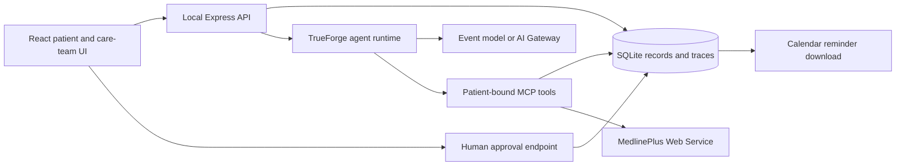

# Homeward

**A clearer path home after discharge.**

Homeward turns discharge instructions into a source-linked follow-up plan, helps patients keep track of next steps, and gives a care team visibility into reported progress and missing information.

Built for the **Agent Harness Hackathon**, organized by TrueFoundry and HackerSquad, sponsored by OpenAI.

## Run locally

Requires **Node.js 22.14+** (Node 24 recommended) and npm.

```sh
npm install
npm run build
npm start
```

Open **http://localhost:8000**. Three hand-authored fictional patients and one official Synthea sample patient are included. No credentials are needed for the source-search and local workflow demo.

For development, use `npm run dev`: the React UI runs on **http://localhost:5173** and proxies API calls to port 8000. Stop `npm start` before starting development mode, since both use port 8000.

## Connect the event tools

1. Start TrueForge in a separate terminal: `npx @truefoundry/trueforge@latest`.
2. Open **http://localhost:8790 → Settings → Models**. Configure the event-provided model access. If the event provides a compatible AI Gateway, use its base URL, key, and exact model ID in a custom provider. Credentials stay in TrueForge, not this repository or the browser.
3. Keep Homeward running and execute **`npm run setup:trueforge`**. This registers the legacy patient connectors and, when a model is configured, four patient/role-scoped connectors and saved agent definitions per seeded patient. Existing definitions and credentials are preserved; a conflicting connector URL requires manual review.
4. Open **Ask Homeward → TrueForge agent**. A coordinator routes requests to the discharge summarizer, questions specialist, reminder assistant, or care-plan coordinator using separate native AgentSpecs and role-scoped MCP tools. Recognized next-step questions stay local in either mode. **My discharge summary** works without a model; live summary requests fall back to recorded sources when unavailable. Other live questions each start a fresh session.

Manual connector setup for Alex:

| Field          | Value                                |
| -------------- | ------------------------------------ |
| Name           | `homeward-demo-001`                  |
| URL            | `http://localhost:8000/mcp/demo-001` |
| Authentication | **No auth**                          |
| Transport      | Streamable HTTP                      |

The convenience endpoint **`http://localhost:8000/mcp`** is also scoped to Alex. `/mcp/demo-002` and `/mcp/demo-003` serve the other synthetic patients. The agent cannot change its connector's patient through tool arguments.

To select a specific configured model, copy `.env.example` to `.env` and set `TRUEFORGE_MODEL` to its fully qualified `provider/model` name. Optional `TRUEFORGE_URL` and `TRUEFORGE_TOKEN` configure the server connection. **Never commit `.env` or credentials.**

For future **OpenAI** access, configure the provider/key in TrueForge Settings → Models or your approved TrueFoundry AI Gateway, then select the exact available model FQN. Homeward does not need an `OPENAI_API_KEY` or a direct OpenAI client. All specialists use the same provider-independent selection; an unavailable override is reported instead of silently switching models. See [the agent-team contract and capability register](docs/AGENT-TEAM.md).

The app uses TrueForge's HTTP API and MCP execution. Gateway routing, provider failover, and dollar-denominated hard limits are **not implemented by Homeward**. Use the event's gateway configuration if these are required. The local harness enforces iteration, time, and request-count limits and shows actual metrics returned by TrueForge.

## What works

- **Patient recovery plan:** sourced tasks, known deadlines, clarification items, patient-reported completion, and persistent state.
- **Next-step guidance:** “What is my next step?” agrees with the dashboard's earliest eligible recorded deadline. Undated, paused, clarification, and inactive tasks remain distinct. Exact citations, reviewed instructions, and date provenance are preserved; asking does not create an action. See [the guidance contract and TrueForge capability record](docs/NEXT-STEP-GUIDANCE.md).
- **Accessible discharge summary:** grouped recorded steps, missing details, reported completion, unreviewed passages, and historical context, with exact-source links and visible date provenance. Live specialists select references through native structured output; clinical instructions and receipts are rendered from validated records rather than unrestricted model prose.
- **Agent team:** four task-routed specialists with role-specific prompts and server-enforced MCP inventories. The patient sees the responsible role and whether a result used a model, saved records, or a fallback. One specialist handles each live request; dynamic subagents are not enabled.
- **Emergency call control:** a persistent native `tel:911` link labeled for the US synthetic demo, independent of plan/API/model readiness. It is a user-controlled device action, not agent dispatch.
- **Discharge record import:** text-based PDFs, TXT/Markdown files, and pasted text. Passages become searchable; exact cited instructions can be added for human review. Scanned-image OCR is not included.
- **Retrieval:** deterministic lexical passage search locally; a connected TrueForge agent can retrieve passages and answer with their context. No vector database or embedding service is required for this small corpus.
- **Approval-controlled reminders:** propose, approve or decline, execute, and download a real `.ics` calendar file. Local reminder creation is not an appointment booking, email, SMS, or scheduled notification service.
- **Failure demo:** simulate response loss after a reminder is stored; retry the same action and receive the original receipt without creating a duplicate.
- **Care-team overview:** synthetic patients with pending, completed, overdue, help-requested, and clarification states. It is a demo view, not a role-authenticated clinician portal.
- **Online education:** live MedlinePlus Web Service lookup using only fixed general topic searches, with attributed curated links when unavailable. Results are cached for 12 hours. Education never changes the patient's care plan.
- **Agent activity:** actual application/MCP traces, approval decisions, latency, TrueForge session IDs, and reported token/cost metrics. Missing cost data is labeled as unavailable.
- **Evaluation evidence:** isolated deterministic guardrail checks, an actual MCP protocol test, and a DOM interaction test covering the main journey.

## MCP tools

| Tool                            | Purpose                                                        |
| ------------------------------- | -------------------------------------------------------------- |
| `get_discharge_plan`            | Read the bound patient's tasks, sources, actions, and next-step guidance |
| `get_discharge_summary`         | Read a grouped, source-linked summary without approving or altering instructions |
| `search_discharge_instructions` | Return relevant exact passages with source identifiers         |
| `propose_cited_task`            | Add an exact passage for review; never infer a deadline        |
| `propose_reminder`              | Create an approval request for a known dated task              |
| `execute_approved_reminder`     | Execute only after a human approval; reuse receipts on retries |
| `lookup_patient_education`      | Retrieve general educational links without patient identifiers |

There is deliberately **no approval tool**. Approval happens through the app UI/API; an agent cannot approve its own action using the exposed MCP tools. The demo's local API is not user-authenticated, so this boundary is a tool-permission boundary, not a production identity system.

The legacy patient endpoints expose these seven tools. Specialist endpoints at
`/mcp/:patientId/:role` expose only the role's subset; the summarizer and questions
specialist cannot propose or execute reminders. Review and help-resolution endpoints
remain human-only application operations.

## Architecture



The task state machine is deterministic. The model can retrieve, explain, and propose; the backend controls whether an action can execute. Unknown or imported deadlines remain null. Uploaded material is untrusted data in the agent instructions; source checks prevent invented citations from becoming tasks. These controls do not make language-model medical responses clinically validated.

## Verify

```sh
npm test
npm run eval
npm run build
```

`npm run eval` writes `.local/evaluation.json`; the Agent activity screen reads that report. Results are generated by running the checks, not hardcoded. Tests use separate in-memory or temporary databases and do not reset your local demo.

Once a model is connected and the app is running, **`npm run smoke:trueforge`** performs a real model/tool run. This uses your configured model and may consume event credits. Review the response and trace; automated runtime checks are not a substitute for clinical evaluation.

Use `npm run smoke:trueforge -- --summary` to exercise the summarizer. The smoke
script requires a verified model-assisted result, not a local fallback, and reports
the actual role, session ID, citations, and available usage metrics.

GitHub Actions runs the tests, evaluation, and production build on pushes and pull requests. See [the demo script](docs/DEMO.md), [team ownership](docs/TEAM.md), [validation notes](docs/VALIDATION.md), and the [dataset and agent integration guide](docs/DATASET-AND-AGENT-INTEGRATION-GUIDE.md).

## Scope and demo data

- All bundled names, discharge records, and instructions are fictional. The scenario date is pinned to **September 19, 2026**, making overdue cases reproducible. Reminder dates follow that demo scenario.
- The app binds to **127.0.0.1**. Do not expose the no-auth app or MCP server publicly or enter real patient data. Shared use needs authentication, role-based authorization, consent, encryption and deployment controls, and a clinical review process.
- Files and SQLite data live under `.local/`, which is ignored by Git. Only synthetic fixtures are committed. Resetting the demo removes local imported records, reminders, and traces after confirmation.
- Real EHR/FHIR connectivity, appointment booking, medication reconciliation, automated outreach, and clinician resolution of review items are future integrations.
- Browser-control availability is environment-dependent. The included DOM tests exercise interactions but do not replace visual/responsive browser review.

## References

- [TrueForge quickstart](https://trueforge.dev/quickstart)
- [TrueForge model configuration](https://trueforge.dev/models)
- [TrueForge MCP connectors](https://trueforge.dev/mcp-servers)
- [Model Context Protocol TypeScript SDK](https://github.com/modelcontextprotocol/typescript-sdk)
- [MedlinePlus Web Service](https://medlineplus.gov/about/developers/webservices/)

MedlinePlus.gov provides the linked educational information and does not endorse Homeward.

## Synthea sample and help requests

Open **Care team → Hui Stoltenberg** to explore the bundled Synthea patient. Open **My documents → Synthea historical record** for the official source URL, archive hash, and per-passage CSV file, row, fields, and file hash. The snapshot is selected from the latest completed inpatient encounter in the official sample archive. Records are filtered as of that discharge date, conservatively excluding records stopped on that day. These are historical synthetic records, not verified discharge orders; no medication schedules or deadlines are inferred.

Regenerate the bundled sample with Python 3 (network access required): `python scripts/ingest-synthea.py`. The upstream latest archive can change; review the resulting patient and provenance diff before accepting it. The bundled JSON works offline. Existing local patients are not overwritten at startup; use the app's explicit demo reset to reload a changed snapshot.

**Need help** flags an open task in the local care-team view. It persists in SQLite and pauses completion, reminder proposals, and execution of previously approved reminders. Clearing help preserves the original clarification status. It does not notify a clinician or send any external message. Already-created calendar files are not recalled.

Data sources remain distinct: hand-authored demo instructions, imported user documents, the [official Synthea sample dataset](https://github.com/synthetichealth/synthea-sample-data), and general MedlinePlus education. The Synthea ingestion is implemented independently; no code from Harbor was copied.
