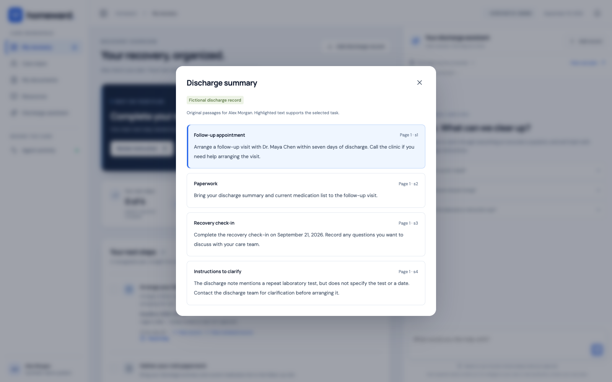
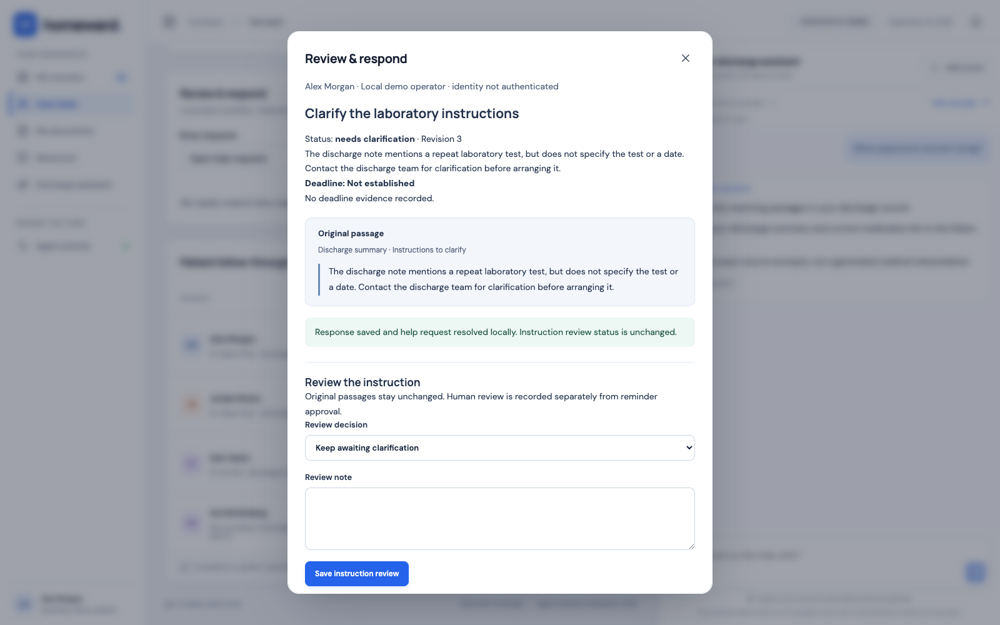
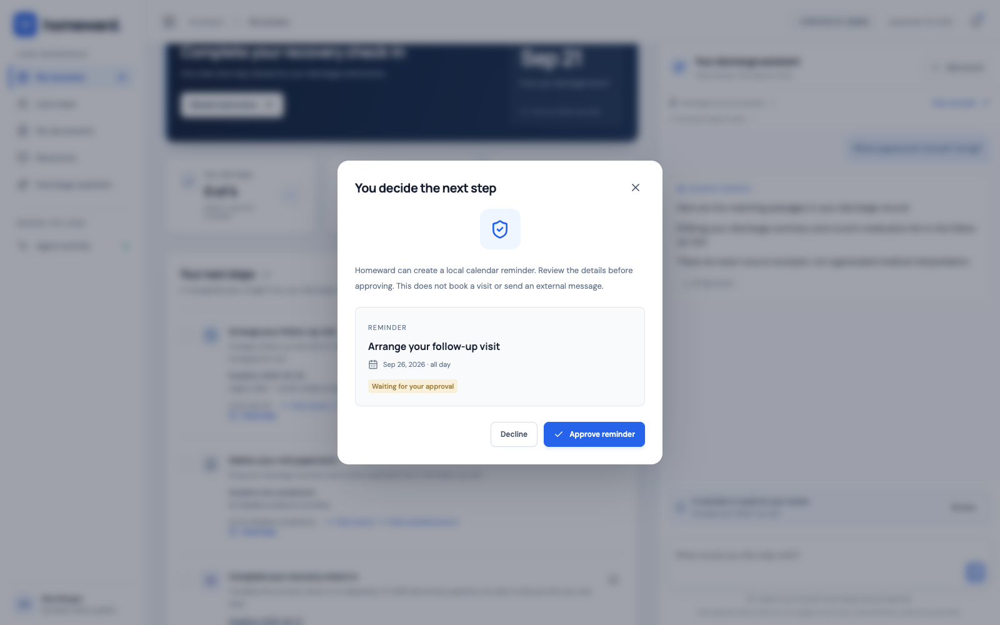
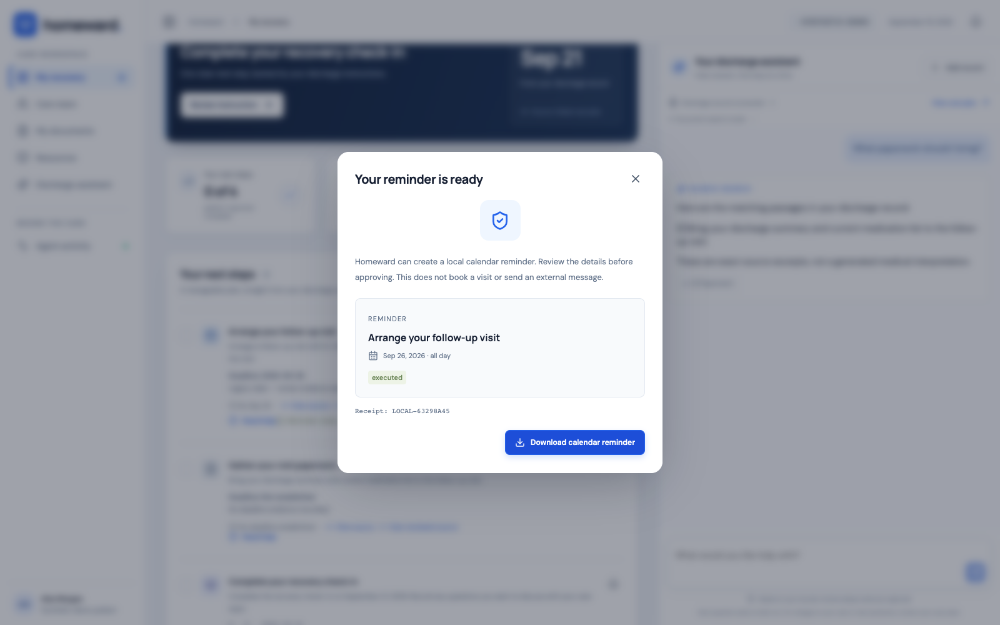
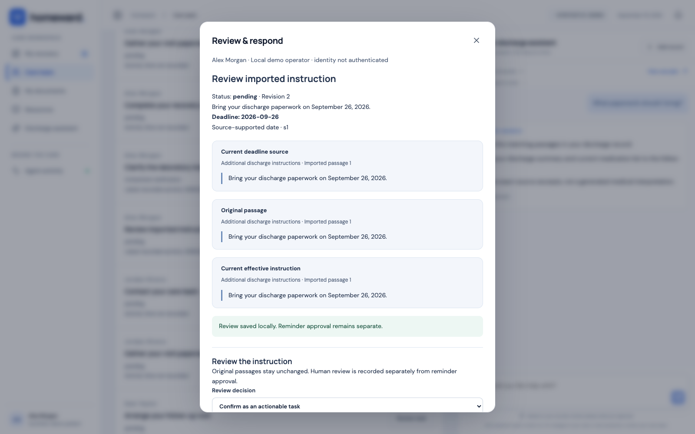
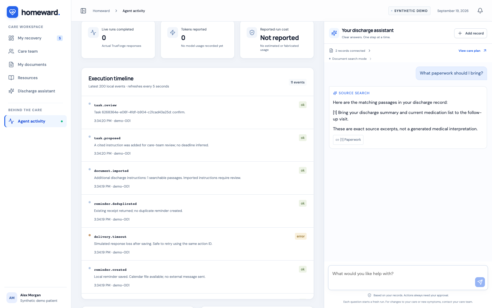
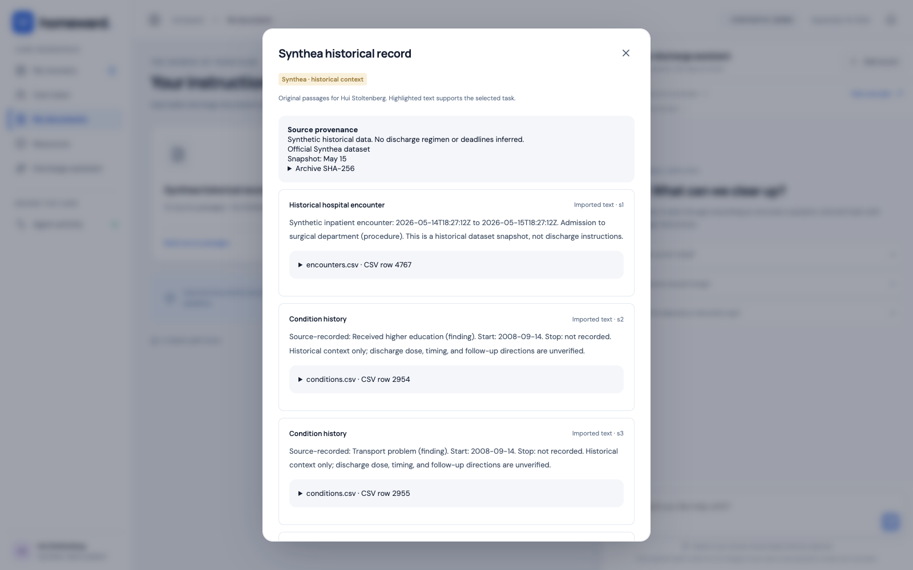
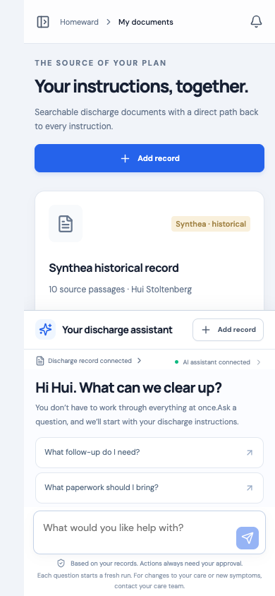

# Patient journey: from instructions to a reviewable next step

This walkthrough pairs a patient story with the action the software actually performs. The intended benefit is clarity and follow-through; no outcome study has measured that benefit.

**Capture provenance:** the ten images below were recorded in Chrome on September 19, 2026 from application commit `0ce9dad2a4a9dfd4815cad0a742fb46baa29bad5`, with an isolated in-memory synthetic Store. Chat used **Source search**, with live requests blocked. They are reused without alteration, not fresh screenshots of the current `eaf86d9` implementation. [Manifest](assets/journey/manifest.json) · [Original report](evidence/integrated-main/browser.json)

The current app additionally includes next-step guidance, a grouped summary, four specialist roles, and a US emergency-call link. Those additions are described below and have automated tests, but are not visible in these older captures. Some captures show “AI assistant connected”; that label is not proof of valid provider credentials or a successful model run.

## 1. Find the next recorded step

**Action:** Alex opens My recovery. **Response:** the next-task card, checklist, known dates, and assistant are visible together. **Intended benefit:** Alex can focus on one recorded step while keeping questions close by.

**Presentation caption:** “A next step with a source behind it.” The next task is scheduling guidance, not a clinical urgency assessment. In the current version, asking “What is my next step?” returns the same derived guidance as the dashboard without invoking a model.

## 2. Inspect the original instruction

**Action:** choose View source on the follow-up. **Response:** the exact original paragraph appears with its section information. **Intended benefit:** the patient can verify where the instruction came from.

**Presentation caption:** “Every task should be traceable.” The demo's seeded September 26 deadline is labeled legacy evidence; this screen is not proof that a model calculated the date. New reviews handle relative dates through explicitly attributed human clarification.

## 3. Ask about visit paperwork

**Action:** ask “What paperwork should I bring?” in Source search. **Response:** the recorded instruction to bring a discharge summary and medication list is quoted with a source link. **Intended benefit:** find the relevant passage without rereading the full document.

**Presentation caption:** “An answer you can inspect.” This is deterministic retrieval, not an LLM answer. The current live specialist path requires a configured model and validates reference selections before reconstructing exact-source content; this screenshot does not verify that path.

## 4. Ask for help without clearing uncertainty

**Action:** Alex requests help on the laboratory item; a local care-team demo operator responds and resolves the conversation. **Response:** the response is saved, but task status remains `needs_clarification` and no deadline is established. **Intended benefit:** a human handoff can address the question without accidentally authorizing an unspecified test.

**Presentation caption:** “A response is not an instruction approval.” The review queue behind the modal is the local team's visibility surface; this capture is not a separate unobscured queue overview. Patient withdrawal and operator resolution remain distinct audit events. No external notification was sent.

## 5. Approve a local reminder

**Action:** request a reminder for an eligible dated task. **Response:** Homeward presents a proposal with Approve and Decline controls. **Intended benefit:** the patient decides whether to proceed.

**Presentation caption:** “The agent can propose; a person approves.” Instruction review, reminder approval, and execution are separate operations. A pending help request or changed task can prevent the action from proceeding.

## 6. Recover from a lost response

**Action:** approve, enable the timeout demo, create the reminder, then retry after the simulated lost response. **Response:** the existing receipt is returned and the calendar file is downloadable. **Intended benefit:** an uncertain response does not create a duplicate action.

**Presentation caption:** “One saved reminder, even after a retry.” This image shows the successful result after retry, not the timeout itself. The original browser assertions and [activity capture](#8-inspect-what-actually-happened) establish the simulated timeout/deduplication sequence. The exported [synthetic calendar artifact](assets/journey/reminder.ics) is not an appointment booking or a scheduled outbound notification.

## 7. Review an imported instruction

**Action:** import the synthetic sentence “Bring your discharge paperwork on September 26, 2026.” Add its passage for review; a local operator confirms the exact instruction and date evidence. **Response:** the task becomes pending, retaining original/effective citations and the recorded review. **Intended benefit:** new information becomes actionable through an explicit, inspectable decision.

**Presentation caption:** “New information stays reviewable.” Reading or uploading a passage does not itself approve a task. An unknown deadline stays unknown unless supported through the review contract.

## 8. Inspect what actually happened

**Action:** open Agent activity. **Response:** the local timeline shows stored review, creation, simulated timeout, and deduplication events. **Intended benefit:** the team can inspect the action sequence rather than infer it from a chat answer.

**Presentation caption:** “Evidence of the workflow, including failure recovery.” The capture shows zero completed live runs and no reported run cost. It is trace evidence, not a screenshot of the current evaluation score. Current evaluation results are linked in [the audit record](evidence/readme-audit/README.md).

## 9. Distinguish history from discharge orders

**Action:** open Hui Stoltenberg in Care team, then My documents → Synthea historical record. **Response:** the source URL, snapshot date, archive hash control, and CSV row metadata are visible. **Intended benefit:** the patient/operator can see where context originated and why it is not an approved discharge regimen.

**Presentation caption:** “Realistic synthetic history, explicit limits.” Confirmation requires separately documented discharge instructions; medication timing is never inferred from historical descriptions or product strengths.

## 10. Keep the assistant available on a narrow screen

**Action:** view the document workspace at 390×844 and dismiss the navigation overlay. **Response:** content and assistant stack vertically; the recorded browser run found no horizontal page overflow. **Intended benefit:** preserve access to the assistant without forcing a desktop-width layout.

**Presentation caption:** “The same workflow in a narrower viewport.” This is one viewport observation, not a full responsive or accessibility audit. Additional summary/navigation elements arrived after this capture.

## New in the current app: summary and specialist team

For a walkthrough on `eaf86d9`, also open **My discharge summary**. It groups actionable tasks, gaps, completed/rejected history, unreviewed passages, and historical context. Choose **Open summary** for the saved-record view or **Ask discharge summarizer** for model-assisted selection when configured. Older chat summaries are labeled after records change. These actions do not review an instruction or create a reminder.

The team contains a coordinator, summarizer, questions specialist, and reminder specialist. One role handles each live request, with a distinct tool inventory. A local fallback is labeled as such. Native `tel:911` is a US-demo device action, available independently of plan/model loading; do not place a real emergency call during a demonstration. [Agent contract](AGENT-TEAM.md) · [Guidance contract](NEXT-STEP-GUIDANCE.md)

Fresh captures of the summary, specialist labels, current care-team queue, and emergency-control placement remain to be taken in a connected browser. The existing images are not relabeled as evidence for those additions.

## Capture provenance and reproduction

The [derived manifest](assets/journey/manifest.json) preserves the original run's commit, browser version, capture interval, viewport, captions, dimensions, and image hashes. Per-image capture timestamps were not recorded; the manifest uses the original run interval rather than inventing them. The numbered captures are used; `failure.png` is a preserved failed recorder attempt and is not a successful product screenshot.

The existing [browser runner](../scripts/evaluations/browser-journey.js) starts an isolated in-memory application instance, blocks live-chat requests, and records screenshots/assertions. Its default Chrome path is macOS-specific and it requires separate Playwright tooling. The [original reproduction instructions](evidence/integrated-main/README.md#reproduce-the-pinned-app) document the captured snapshot and its environment.

For a new capture session:

1. Use a disposable clone or archive of the exact intended application commit and build it. Do not point it at the team's active SQLite file.
2. Use an authorized connected browser or adapt the recorder to the local browser/tooling environment. The existing runner reads the capture commit from `docs/evidence/integrated-main/commit.txt` and has fixed output paths; changing only `APP_ROOT` does not update that metadata. In the disposable capture workspace, align the recorded SHA, application snapshot, and output locations before running.
3. Keep old reports and captures intact. Write the new session into a distinct dated/commit-labeled evidence folder.
4. Use Source search for the deterministic journey; record real sessions separately for any authorized live-model screenshots. Do not use `?history=1` or cached chat as evidence of a new live turn.
5. Capture the new summary/team views at laptop, presentation, and narrow widths. Check keyboard focus, zoom, long passages, and the reachable chat composer. Do not activate the emergency telephone link.
6. Record actual timestamps, viewport, browser version, command/test results, image hashes, and model-call count. Publish results with their limitations.

This documentation pass inspected the existing image files and verified their hashes. No browser surface was available for a new capture session, and no team's demo data was mutated for screenshots.
