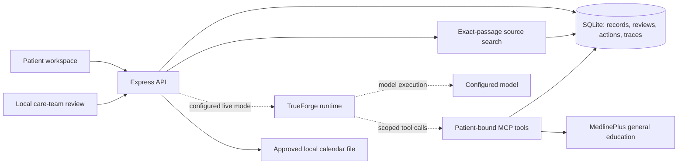
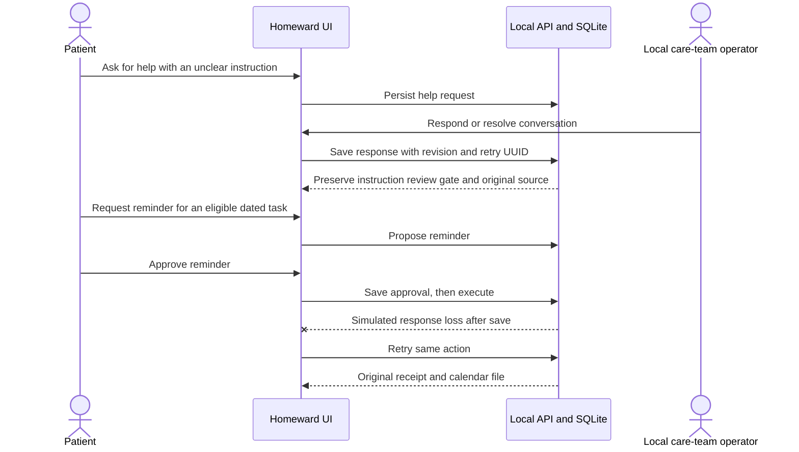

# Homeward: verified presentation story

Application baseline: **`0ce9dad2a4a9dfd4815cad0a742fb46baa29bad5`**, fetched from
`origin/main`. Screenshots come from its production build in Chrome against an
isolated real backend. They show **source search**, not live model answers.
See [integrated verification](evidence/integrated-main/README.md) for actual results.

## Patient outcome and opening

“Homeward helps a patient understand the next step after discharge, see where it
came from, and flag what still needs clarification. It makes follow-through visible
while keeping instructions and actions reviewable.”

The intended result is a clearer, source-linked recovery plan and fewer unresolved
coordination questions. Improved adherence, reduced readmissions, clinical accuracy,
and actual health benefits have not been established by this prototype.

## Six-slide narrative

| Slide                                             | Message and visual                                                                                                         | Evidence to explain                                                                                                                                                                                         |
| ------------------------------------------------- | -------------------------------------------------------------------------------------------------------------------------- | ----------------------------------------------------------------------------------------------------------------------------------------------------------------------------------------------------------- |
| 1. A clearer next step                            | [Recovery workspace](assets/journey/01-recovery.png)                                                                       | Known tasks and dates are visible; missing information remains explicit.                                                                                                                                    |
| 2. Answers grounded in the record                 | [Source passage](assets/journey/02-source.png), [paperwork search](assets/journey/03-source-search.png)                    | Exact excerpts support the answer. This captured demo uses deterministic retrieval, not an LLM.                                                                                                             |
| 3. Asking for help does not verify an instruction | [Help response](assets/journey/04-help-review.png)                                                                         | A local care-team response resolves the conversation while the laboratory instruction still requires clarification.                                                                                         |
| 4. Patient control and reliable local action      | [Approval](assets/journey/05-approval.png), [safe retry](assets/journey/06-safe-retry.png)                                 | Approval is separate; response loss and retry create one calendar reminder. No appointment is booked or message sent.                                                                                       |
| 5. New information remains reviewable             | [Imported instruction review](assets/journey/07-import-review.png), [Synthea provenance](assets/journey/09-provenance.png) | Original citations remain available. Historical data cannot establish discharge dosage instructions.                                                                                                        |
| 6. What we actually verified                      | [Activity](assets/journey/08-activity.png)                                                                                 | Merged baseline: 40 Node tests, 2 DOM tests, build, 21 evaluation cases, and the real-browser journey passed. One authorized live request failed with an invalidated-key 401; no model answer was returned. |

Supplement: [mobile-width capture](assets/journey/10-mobile.png). No horizontal
page overflow was observed at 390×844; this is not a full mobile or accessibility audit.
Some screenshots show “AI assistant connected”; this indicates a configured model only. The invalid-key trial demonstrates that this label does not prove provider authentication. All captures use synthetic patients. The [manifest](evidence/integrated-main/browser.json)
records browser version, viewport, timestamps, scenario steps, and screenshot hashes.

## Architecture for the presentation

The dashed runtime/model path is implemented but **not validated by this captured
source-search journey**. Local operator review is not authenticated clinical review.

## Rehearsal

1. Start the pinned snapshot using the instructions in the integrated evidence guide.
2. Use Alex. Show a source and ask the paperwork question in **Source search**.
3. Open help for the laboratory item; show local care-team resolution preserves review.
4. Propose a follow-up reminder, approve, simulate response loss, retry, download.
5. Show activity and the verified counts above. If demonstrating imported review,
   use the synthetic passage and explicit source date shown in the screenshot.
6. Close with the intended patient benefit and the live-agent limitation.

Keep the exact application SHA on the final slide. If main changes, rerun verification
and regenerate captures before substituting the new version. Do not label a model
listing or a simulated-provider test as successful live-agent integration.
